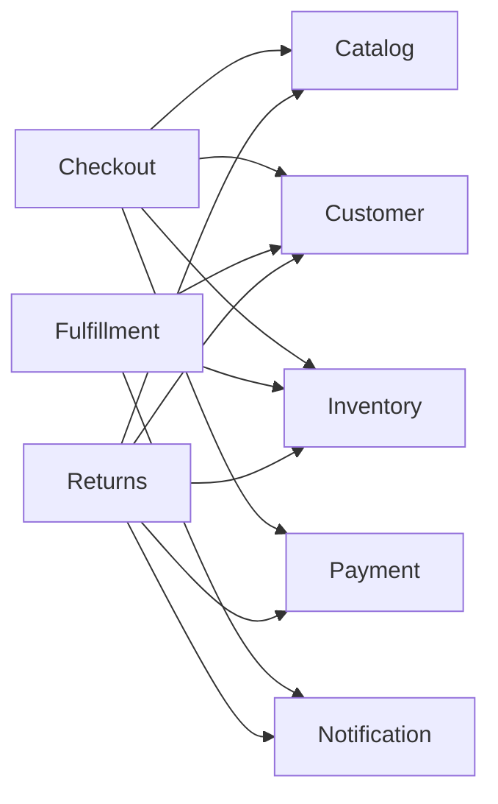
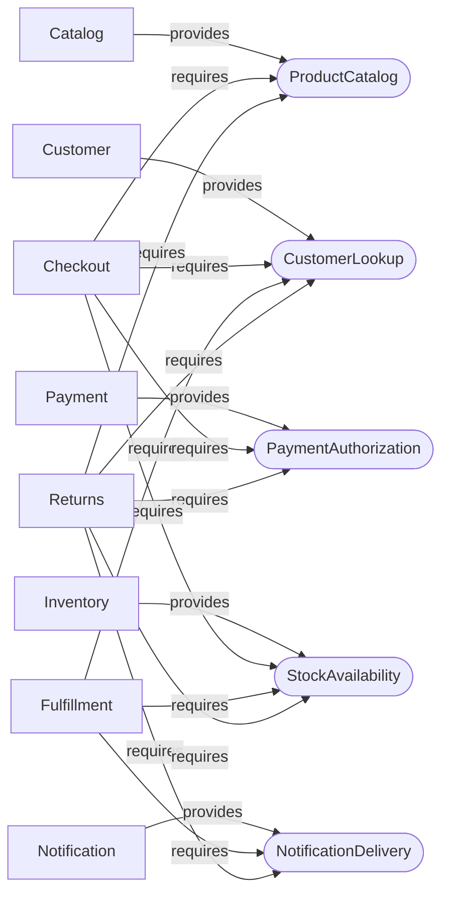
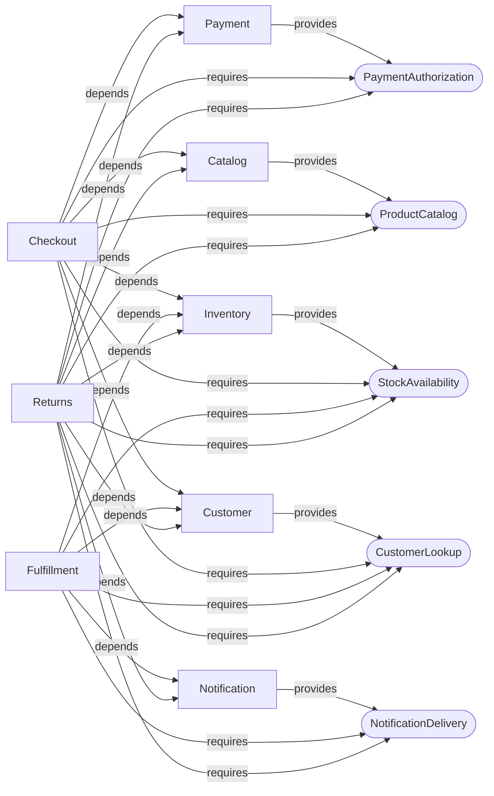

# Interactive Graph Examples

Moduark exposes direct Module dependencies, Capability relationships, and their
combined architecture without flattening them into one ambiguous edge type.

[Open the standalone interactive graph explorer](examples/interactive-graphs.html).
It has no build step or third-party runtime dependency and can be embedded into
a future documentation website. The controls switch graph views, select a
Module neighborhood, toggle the color theme, and copy the exact Mermaid source
for the current state.

## Executable Example Source

The explorer mirrors the repository's Large Level 2 acceptance fixture rather
than presenting an untested marketing diagram:

| Evidence | Count |
|---|---:|
| Modules | 8 |
| Direct dependencies | 12 |
| Capabilities | 5 |
| Capability edges | 17 |
| Consumer Port / Adapter bindings | 12 |

Providers are `Catalog`, `Customer`, `Inventory`, `Notification`, and `Payment`.
Consumers are `Checkout`, `Fulfillment`, and `Returns`. The fixture passes all
eight Level 2 rules and resolves every consumer Port through Laravel's container.

The interactive page keeps one embedded graph model as the source for:

- the rendered SVG;
- the visible relationship list and screen-reader description;
- the Module, Capability, and Combined filters;
- the copyable Mermaid output.

A repository test compares that model with the PHP fixture's compiled graph, so
the website example cannot silently drift from executable package behavior.

## Generate the Views

Use the same commands in an application:

```bash
php artisan moduark:graph --view=module --format=mermaid
php artisan moduark:graph --view=capability --format=mermaid
php artisan moduark:graph --view=combined --format=mermaid
```

Select one Module by placing its name after the command:

```bash
php artisan moduark:graph Checkout --view=combined --format=mermaid
```

The neighborhood contract depends on the view:

- Module includes the selected Module plus its incoming and outgoing direct
  dependencies;
- Capability includes every Capability used or provided by the selected Module,
  along with all providers and sibling consumers on those Capabilities;
- Combined uses the union of those neighborhoods while retaining `depends`,
  `requires`, and `provides` as separate edge kinds.

## Static Module View

The direct graph answers which Modules reference which provider Modules. It does
not claim to show consumer Port intent.



Text alternative: Checkout directly depends on Catalog, Customer, Inventory,
and Payment. Fulfillment directly depends on Customer, Inventory, and
Notification. Returns directly depends on all five provider Modules.

## Static Capability View

The Capability graph preserves demand and supply as different relationships.
Multiple consumers may own different Ports for the same Capability identity.



Text alternative: each Capability has one provider. Checkout requires four,
Fulfillment requires three, and Returns requires all five Capabilities.

## Static Combined View

The combined view overlays both domains while preserving edge labels. Direct
dependencies remain the authorization for Adapter-to-provider references;
Capability edges describe why the relationship exists.



Text alternative: the combined graph contains the same 12 direct dependencies
and 17 Capability edges. It adds no inferred or effective edge that is absent
from validated Module metadata.

## Website Integration Boundary

This repository does not currently select a documentation-site framework. The
standalone page therefore uses semantic HTML, inline CSS, and browser-native
JavaScript only. It does not add Node dependencies, a build pipeline, hosted
assets, analytics, or a deployment workflow.

When a website framework is selected, keep these contracts:

- graph data remains traceable to executable fixtures or exported application
  output;
- all three edge types retain distinct labels and text alternatives;
- light and dark themes remain readable;
- interactive filters never replace the static Markdown fallback;
- package CLI and graph domain remain the source of truth.

See [Architecture Levels](architecture-levels.md#level-2--decoupled) for the
Capability contract and [ADR-0024](adr/0024-combined-graph-output.md) for the
combined-neighborhood decision.
